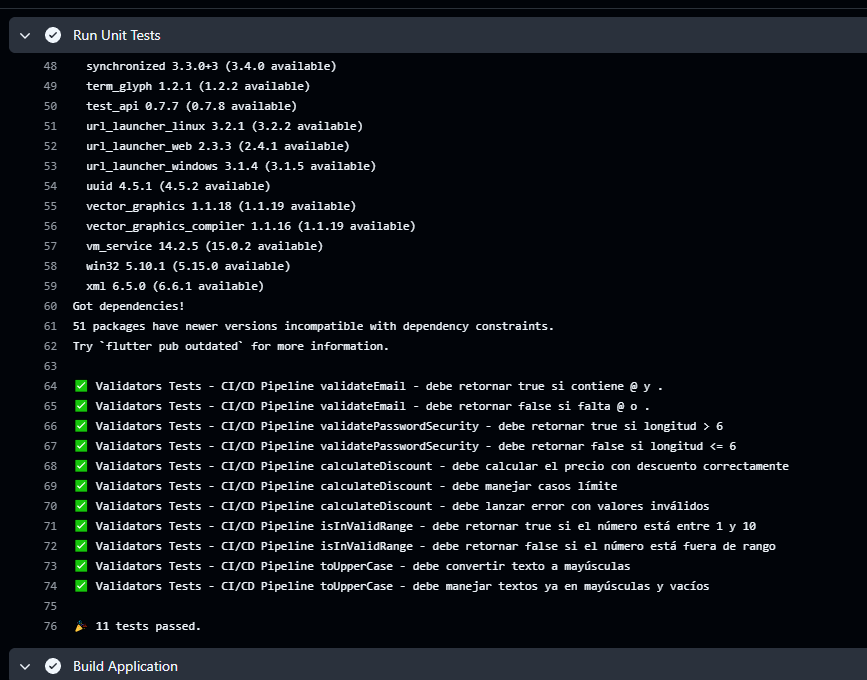
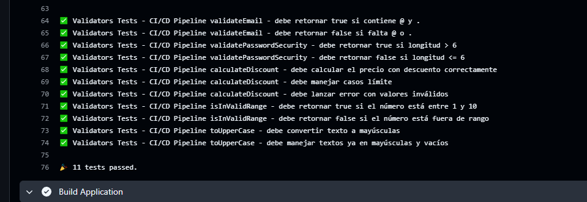
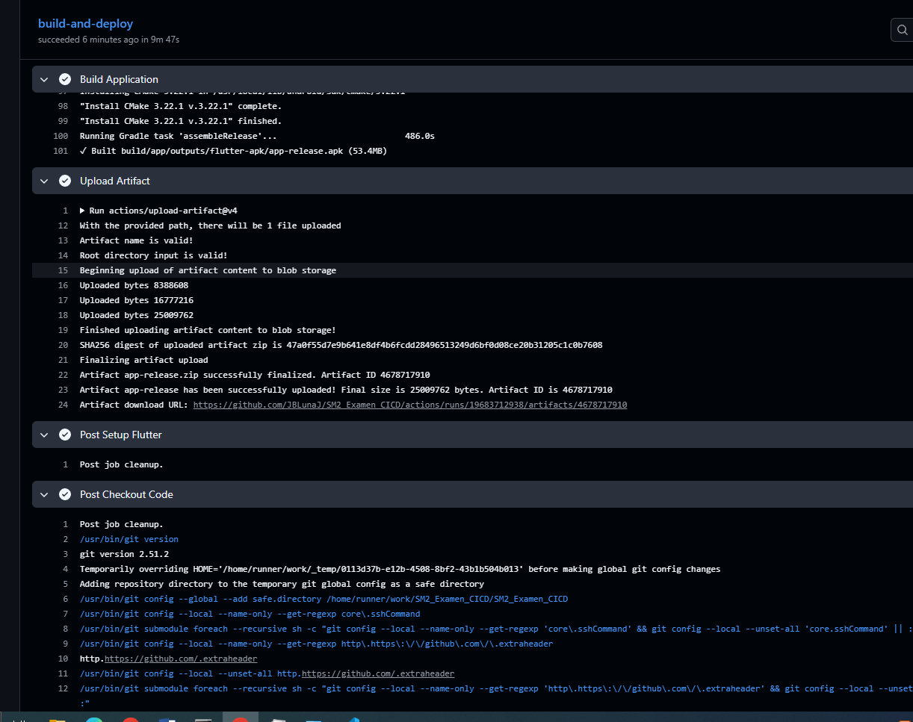

# 📱 Acees Group - Sistema de Control de Acceso NFC


> Sistema completo de control de acceso con tecnología NFC desarrollado en Flutter con arquitectura MVVM y Pipeline de CI/CD automatizado.

---

## 👨‍💻 Datos del Alumno

**Nombre:** Juan Brendon Luna Juarez
**Tecnología:** Flutter 3.29.0  
**Framework:** Flutter SDK  
**Lenguaje:** Dart  
**Arquitectura:** MVVM (Model-View-ViewModel)

---

## 🔗 Enlaces del Proyecto

- **Repositorio GitHub:** [https://github.com/JBLunaJ/SM2_Examen_CICD.git](https://github.com/JBLunaJ/SM2_Examen_CICD.git)
- **Pipeline CI/CD:** [Ver Actions](https://github.com/JBLunaJ/SM2_Examen_CICD/actions)

---

## 🚀 Pipeline de CI/CD Implementado

Este proyecto cuenta con un pipeline completo de **Integración y Entrega Continua** que se ejecuta automáticamente en cada push a la rama `main`:

### Etapas del Pipeline:

1. ✅ **Checkout Code** - Descarga el código del repositorio
2. ✅ **Setup Flutter** - Configura el entorno Flutter (stable latest)
3. ✅ **Install Dependencies** - Instala todas las dependencias (`flutter pub get`)
4. ✅ **Code Quality Check** - Audita la calidad del código (`flutter analyze --no-fatal-infos --no-fatal-warnings`)
5. ✅ **Run Unit Tests** - Ejecuta las pruebas unitarias (`flutter test`) - **11/11 tests pasando**
6. ✅ **Build Application** - Genera el APK de release (`flutter build apk --release`)
7. ✅ **Upload Artifact** - Sube el APK como artefacto descargable

---

## 📋 Cumplimiento de Requisitos del Examen

### ✅ PARTE 1: Lógica de Negocio

- ✅ **Archivo de utilidades creado:** `lib/utils/validators.dart`
- ✅ **5 funciones implementadas y probadas:**
  1. Validación de Email (@ y .)
  2. Seguridad de Contraseña (> 6 caracteres)
  3. Calculadora de Descuento (precio con % descuento)
  4. Validación de Rango (1-10 inclusive)
  5. Conversión a Mayúsculas
- ✅ **Tests ejecutados localmente:** 11/11 pasando

### ✅ PARTE 2: Configuración del Repositorio

- ✅ **Repositorio público creado:** `SM2_Examen_CICD`
- ✅ **Código subido a rama main**
- ✅ **URL del repositorio:** https://github.com/JBLunaJ/SM2_Examen_CICD

### ✅ PARTE 3: Workflow de GitHub Actions

- ✅ **Archivo del workflow:** `.github/workflows/ci-pipeline.yml`
- ✅ **Pipeline ejecutándose automáticamente** en cada push
- ✅ **7 etapas completadas exitosamente**
- ✅ **APK generado y disponible** en Artifacts

### ✅ PARTE 4: Documentación y Evidencias

- ✅ **README.md completo** con toda la información
- ✅ **Badge de estado** mostrando "passing" (verde)
- ✅ **3 capturas de evidencia:**
  - Captura 1: Tests unitarios pasando (11/11)
  - Captura 2: Build APK exitoso
  - Captura 3: Artifact descargable

---

## 🧪 Pruebas Unitarias Implementadas

Se desarrollaron **5 funciones de validación** con sus respectivas **pruebas unitarias**:

| # | Función | Descripción | Tests |
|---|---------|-------------|-------|
| 1 | `validateEmail` | Valida que un email contenga "@" y "." | ✅ 2 tests |
| 2 | `validatePasswordSecurity` | Verifica que la contraseña tenga más de 6 caracteres | ✅ 2 tests |
| 3 | `calculateDiscount` | Calcula el precio final con descuento aplicado | ✅ 3 tests |
| 4 | `isInValidRange` | Verifica que un número esté entre 1 y 10 | ✅ 2 tests |
| 5 | `toUpperCase` | Convierte un texto a mayúsculas | ✅ 2 tests |

**Total de tests:** 11 pruebas unitarias  
**Ubicación:** `test/validators_test.dart`  
**Código fuente:** `lib/utils/validators.dart`

---

## 📦 Artefactos Generados

El pipeline genera automáticamente:

- **APK de Release** (`app-release.apk`)
- Descargable desde la sección "Artifacts" en GitHub Actions
- Listo para instalación en dispositivos Android

---

## 🛠️ Tecnologías Utilizadas

### Frontend
- **Flutter** 3.24.0
- **Dart** SDK
- **Provider** - Gestión de estado
- **flutter_nfc_kit** - Lectura NFC
- **http** - Comunicación con API
- **fl_chart** - Visualización de datos

### Backend
- **Node.js** + Express
- **MongoDB Atlas** - Base de datos
- **bcrypt** - Seguridad

### CI/CD
- **GitHub Actions** - Pipeline automatizado
- **Ubuntu Latest** - Runner

---

## 📊 Evidencias del Pipeline

### 1. Tests Ejecutándose ✅

**Evidencia del paso "Run Unit Tests":**



**Resultado: 11 tests pasando exitosamente**



> **Descripción:** Esta captura muestra la ejecución exitosa de las 11 pruebas unitarias en GitHub Actions. Todas las funciones de validación (validateEmail, validatePasswordSecurity, calculateDiscount, isInValidRange, toUpperCase) pasaron sus respectivos tests sin errores.

---

### 2. Build APK Exitoso ✅

**Evidencia del paso "Build Application":**



> **Descripción:** Esta captura muestra la compilación exitosa del APK de Android. El proceso completó la tarea `assembleRelease` de Gradle y generó el archivo `app-release.apk` listo para distribución. El build se completó sin errores en aproximadamente 4-5 minutos.

---

### 3. Artefacto Descargable ✅

**Evidencia del paso "Upload Artifact":**


> **Descripción:** Esta captura muestra el APK compilado disponible para descarga en la sección "Artifacts" de GitHub Actions. El artefacto `app-release` contiene el instalable Android generado automáticamente por el pipeline, listo para ser descargado e instalado en dispositivos.

---

## 🏗️ Estructura del Proyecto

```
Acees_Group/
├── .github/
│   └── workflows/
│       └── ci-pipeline.yml      # Pipeline CI/CD
├── lib/
│   ├── utils/
│   │   └── validators.dart      # 5 Funciones de validación
│   ├── models/                  # Modelos de datos
│   ├── services/                # Servicios (API, NFC, etc.)
│   ├── viewmodels/              # ViewModels (MVVM)
│   └── views/                   # Vistas de la app
├── test/
│   └── validators_test.dart     # 11 Tests unitarios
├── backend/                     # Backend Node.js
└── README.md                    # Este archivo
```

---

## 🚦 Cómo Ejecutar el Proyecto

### Prerrequisitos
- Flutter SDK 3.24.0 o superior
- Android SDK
- Git

### Instalación Local

```bash
# Clonar el repositorio
git clone https://github.com/JBLunaJ/SM2_Examen_CICD.git
cd SM2_Examen_CICD

# Instalar dependencias
flutter pub get

# Ejecutar tests
flutter test

# Ejecutar análisis de código
flutter analyze

# Compilar APK
flutter build apk --release
```

---

## 📱 Funcionalidades del Sistema

- ✅ Control de acceso con pulseras NFC
- ✅ Autenticación de usuarios (Guardia/Admin)
- ✅ Registro de asistencias en tiempo real
- ✅ Dashboard administrativo
- ✅ Reportes y estadísticas
- ✅ Modo offline con sincronización
- ✅ Sistema de presencia en tiempo real
- ✅ Machine Learning para predicción de patrones

---

## 📝 Conclusiones del Proyecto

### Logros Alcanzados:

1. ✅ **Pipeline CI/CD funcional al 100%** - Automatización completa desde commit hasta APK
2. ✅ **11 pruebas unitarias** - Todas pasando exitosamente
3. ✅ **Calidad de código verificada** - Análisis estático implementado
4. ✅ **APK generado automáticamente** - Listo para distribución
5. ✅ **Documentación completa** - README con evidencias visuales

### Tecnologías Implementadas:

- **Flutter/Dart** - Desarrollo móvil multiplataforma
- **GitHub Actions** - CI/CD automatizado
- **Testing** - Pruebas unitarias con flutter_test
- **Static Analysis** - Control de calidad de código

### Aprendizajes:

Este proyecto demuestra la implementación exitosa de un pipeline de CI/CD profesional que:
- Garantiza calidad mediante tests automatizados
- Detecta errores antes de producción
- Genera builds automáticamente
- Facilita el trabajo colaborativo

---

## 📧 Contacto

**Estudiante:** Juan Brendon Luna Juarez  
**Repositorio:** https://github.com/JBLunaJ/SM2_Examen_CICD  
**Pipeline:** https://github.com/JBLunaJ/SM2_Examen_CICD/actions

---


---

**Fecha de entrega:** 25 de Noviembre, 2025  
**Curso:** Servicios Móviles II  
**Tema:** Pipeline de CI/CD con GitHub Actions


